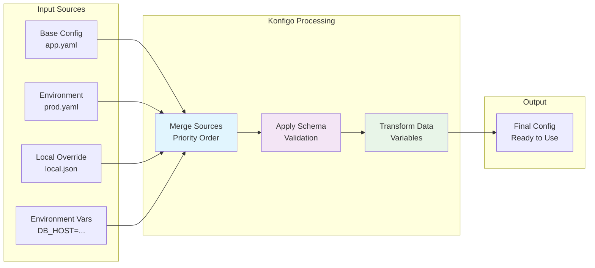
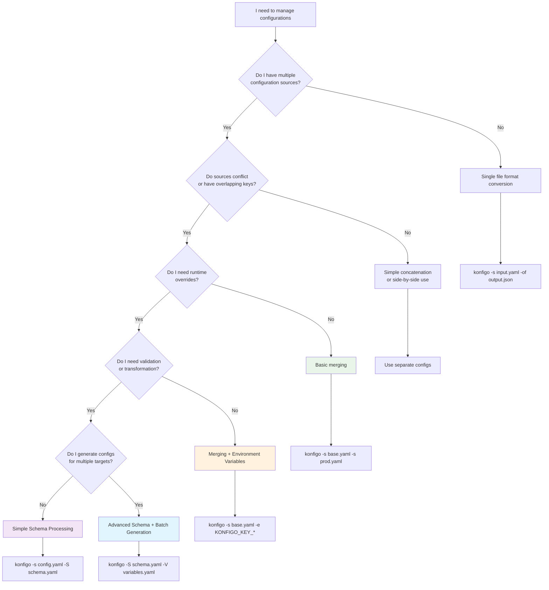

# Basic Concepts: Understanding Konfigo

Now that you've seen Konfigo in action, let's build a solid understanding of how it works. This foundation will help you use Konfigo more effectively and know when to use its advanced features.

## What is Configuration Management?

**Configuration management** is the practice of handling settings, parameters, and options that control how your applications behave. In modern software development, you typically deal with:

- **Application settings** (ports, timeouts, feature flags)
- **Environment-specific values** (database URLs, API keys)
- **Deployment configurations** (replicas, resources, networking)
- **Service discovery** (endpoints, load balancers)

### The Problem Konfigo Solves

Traditional configuration management often leads to:
- 🔥 **Scattered files** in different formats
- 🔄 **Manual copying** and error-prone editing
- 📁 **Duplication** across environments
- 🔍 **Hard to validate** configurations
- 💥 **Runtime failures** from bad configs

**Konfigo centralizes and automates** this entire process.

## Konfigo's Role in Your Workflow

Think of Konfigo as a **configuration compiler** that sits between your source configurations and your final application configs:



### Configuration Sources (Input)
- **Base configurations** (defaults, common settings)
- **Environment overrides** (dev, staging, prod)
- **Local customizations** (developer-specific)
- **Runtime variables** (environment variables)

### Konfigo Processing (Transform)
- **Intelligent merging** with precedence rules
- **Format conversion** (JSON ↔ YAML ↔ TOML ↔ ENV)
- **Variable substitution** and templating
- **Validation** against schemas
- **Transformation** and data generation

### Final Configuration (Output)
- **Single, complete configuration** ready for use
- **Multiple formats** for different consumers
- **Validated and consistent** data
- **Environment-appropriate** values

## The Konfigo Processing Pipeline

Understanding this pipeline helps you predict how Konfigo will process your configurations:

```
1. Discovery     2. Parsing      3. Merging       4. Environment    5. Schema        6. Output
   ┌─────────┐     ┌─────────┐     ┌─────────┐      ┌─────────┐      ┌─────────┐     ┌─────────┐
   │ Find    │────▶│ Parse   │────▶│ Deep    │─────▶│ Apply   │─────▶│ Process │────▶│ Generate│
   │ Sources │     │ Formats │     │ Merge   │      │ Env Vars│      │ Schema  │     │ Output  │
   └─────────┘     └─────────┘     └─────────┘      └─────────┘      └─────────┘     └─────────┘
```

### 1. **Discovery**: Finding Your Configurations
Konfigo finds and identifies configuration files from:
- File paths you specify (`-s file1.yaml,file2.json`)
- Directories (with optional recursion `-r`)
- Standard input (pipe data in)

### 2. **Parsing**: Understanding Formats
Automatic format detection based on:
- File extensions (`.json`, `.yaml`, `.toml`, `.env`)
- Content analysis for ambiguous cases
- Explicit format flags (`-sj`, `-sy`, `-st`, `-se`)

### 3. **Merging**: Combining Configurations
Deep merge with clear precedence:
- Later sources override earlier ones
- Objects are merged recursively
- Arrays are replaced (not merged)
- Null values explicitly override

### 4. **Environment**: Runtime Overrides
Environment variables provide runtime flexibility:
- `KONFIGO_KEY_*` overrides any configuration key
- Highest precedence (always wins)
- Perfect for containerized deployments

### 5. **Schema**: Advanced Processing
Optional schema enables:
- Variable substitution and templating
- Data validation and constraints
- Structure transformation
- Batch output generation

### 6. **Output**: Final Configuration
Generate output in your preferred format:
- Single output to terminal or file
- Multiple formats simultaneously
- Batch generation for multiple environments

## Core Vocabulary

Understanding these terms will help you follow the documentation:

| Term | Definition | Example |
|------|------------|---------|
| **Source** | Input configuration file or data | `base.yaml`, `prod.json` |
| **Merge** | Combining multiple sources into one | `base.yaml` + `prod.yaml` = merged config |
| **Precedence** | Which source wins when values conflict | Later sources override earlier ones |
| **Override** | Replace a value from an earlier source | `port: 8080` → `port: 9090` |
| **Deep merge** | Merge nested objects recursively | Combine `app.features` from multiple sources |
| **Schema** | Rules for processing configurations | Variables, validation, transformation |
| **Environment variable** | Runtime configuration override | `KONFIGO_KEY_app.port=3000` |
| **Variable** | Template placeholder for dynamic values | `${DATABASE_HOST}` |
| **Immutable** | Protected paths that cannot be overridden | Security settings, critical configs |

## When to Use Each Feature

Choose the right Konfigo approach for your needs:



### **Basic Merging** - Start Here
Perfect for:
- Combining base configs with environment overrides
- Converting between configuration formats
- Simple deployment customization

**Example**: Deploy the same app to dev, staging, and prod with different database settings.

### **Environment Variables** - Runtime Flexibility
Great for:
- Containerized applications (Docker, Kubernetes)
- CI/CD pipelines with dynamic values
- Secrets that shouldn't be in files

**Example**: Override database passwords in production without changing config files.

### **Schemas** - Advanced Processing
Use when you need:
- Configuration validation and constraints
- Dynamic value generation (UUIDs, timestamps)
- Complex transformations
- Multiple output formats from one source

**Example**: Generate configs for 50 microservices from a single template.

## Mental Models for Success

### Think in Layers
```
┌─────────────────┐ ← Environment Variables (highest precedence)
│ Runtime Overrides │
├─────────────────┤
│ Local Customization │ ← Developer-specific settings
├─────────────────┤
│ Environment Config │ ← prod.yaml, dev.yaml
├─────────────────┤
│ Base Configuration │ ← defaults.yaml (lowest precedence)
└─────────────────┘
```

### Configuration as Code
Treat your configuration management like software development:
- **Version control** your config files
- **Test** your merging logic
- **Validate** before deployment
- **Document** your configuration patterns

### Progressive Enhancement
Start simple, add complexity as needed:
1. **Basic merge**: Get immediate value
2. **Environment variables**: Add runtime flexibility  
3. **Simple schema**: Add validation
4. **Advanced schema**: Complex transformations

## Common Patterns

### Environment-Specific Deployment
```bash
# Base configuration + environment overlay
konfigo -s app.yaml -s environments/${ENV}.yaml -of final.json
```

### Multi-Service Configuration
```bash
# Generate configs for multiple services
konfigo -s base.yaml -S schema.yaml -V services.yaml
```

### Legacy System Integration
```bash
# Convert and merge legacy configs
konfigo -s legacy.env -s modern.yaml -ot -of integrated.toml
```

## Next Steps

With these concepts in mind, you're ready to:

### **Immediate Application** (15 minutes)
- **[User Guide](../guide/)** - Apply these concepts to real tasks

### **Deeper Understanding** (30 minutes)
- **[Merging Guide](../guide/merging.md)** - Master configuration merging
- **[Environment Variables](../guide/environment-variables.md)** - Runtime configuration

### **Advanced Capabilities** (1+ hours)
- **[Schema Basics](../schema/)** - Unlock validation and transformation
- **[Recipes & Examples](../guide/recipes.md)** - See real-world patterns

## Questions?

- **Confused about a concept?** Check the [FAQ](../reference/faq.md)
- **Need troubleshooting help?** See the [Troubleshooting Guide](../reference/troubleshooting.md)
- **Want to see more examples?** Browse [Recipes & Examples](../guide/recipes.md)

Understanding these fundamentals will make everything else in Konfigo much easier to grasp. Take your time here - it's worth it!
