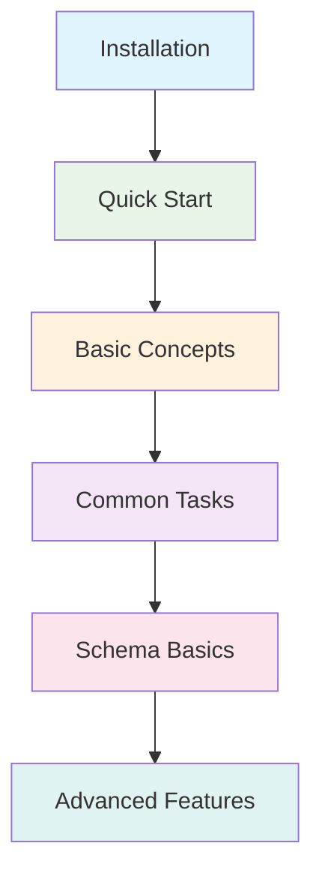

# Getting Started with Konfigo

Welcome to Konfigo! This section will guide you through your journey from installation to mastering configuration management.

## Learning Path

## Your Journey

### 🚀 **Newcomer** (5-10 minutes)
**Goal**: Get Konfigo working and understand what it does

- **Prerequisites**: Basic command line knowledge
- **You'll learn**: How to install, run your first merge, understand the core workflow
- **Next steps**: → Basic Concepts

### 🔧 **Basic User** (30 minutes) 
**Goal**: Handle common configuration management tasks

- **Prerequisites**: Completed Quick Start
- **You'll learn**: Merging strategies, format conversion, environment variables
- **Next steps**: → Schema Basics or User Guide

### 💪 **Power User** (2-3 hours)
**Goal**: Leverage schemas for advanced configuration processing

- **Prerequisites**: Understand basic concepts
- **You'll learn**: Variables, validation, transformation, batch processing
- **Next steps**: → Advanced Features

### 🎯 **Expert** (Ongoing)
**Goal**: Master all Konfigo capabilities and best practices

- **Prerequisites**: Schema basics
- **You'll learn**: Complex schemas, performance optimization, troubleshooting
- **Next steps**: → Contribute to the project!

## Quick Navigation

- **[Installation](./installation.md)** - Get Konfigo installed on your system
- **[Quick Start](./quick-start.md)** - Your first successful merge in 5 minutes
- **[Basic Concepts](./concepts.md)** - Understand how Konfigo works

## What You'll Master

By the end of this section, you'll be able to:

- ✅ Install and verify Konfigo
- ✅ Merge configuration files from different formats
- ✅ Use environment variables to override settings
- ✅ Understand Konfigo's processing pipeline
- ✅ Know when and why to use schemas

Ready to begin? Start with [Installation](./installation.md)!
