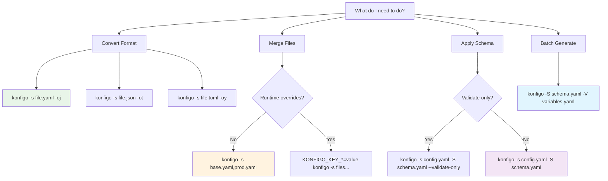

# CLI Reference

Complete command-line reference for Konfigo. Start with the essentials, then explore advanced options as needed.

## Command Decision Tree

Choose the right command pattern for your task:



## Essential Commands

These commands handle 90% of common use cases:

```bash
# Merge configurations
konfigo -s base.yaml,prod.yaml

# Output to file
konfigo -s config.yaml -of final.json

# Convert formats
konfigo -s config.yaml -oj              # YAML to JSON
konfigo -s config.json -oy              # JSON to YAML

# Use environment overrides
KONFIGO_KEY_app.port=9000 konfigo -s config.yaml

# Apply schema processing
konfigo -s config.yaml -S schema.yaml

# Batch generation
konfigo -s base.yaml -S schema.yaml -V variables.yaml
```

## Quick Reference

| Task | Command | Notes |
|------|---------|--------|
| **Basic merge** | `konfigo -s file1.yaml,file2.json` | Merge multiple files |
| **Format conversion** | `konfigo -s config.yaml -oj` | Convert YAML to JSON |
| **Save output** | `konfigo -s config.yaml -of result.json` | Save to file |
| **Environment override** | `KONFIGO_KEY_app.port=8080 konfigo -s config.yaml` | Override any value |
| **Schema processing** | `konfigo -s config.yaml -S schema.yaml` | Apply schema |
| **Batch generation** | `konfigo -s base.yaml -V vars.yaml` | Generate multiple outputs |
| **Validation only** | `konfigo -s config.yaml -S schema.yaml --validate-only` | Check without output |
| **Debug output** | `konfigo -v -s config.yaml` | See what's happening |

---

## Command Structure

```bash
konfigo [global-flags] -s <sources> [processing-flags] [output-flags]
```

### Examples by Use Case

#### **Configuration Merging**
```bash
# Basic merge
konfigo -s base.yaml,env.yaml,local.yaml

# With output file
konfigo -s base.yaml,prod.yaml -of production.json

# Recursive directory merge
konfigo -r -s configs/ -of merged.yaml

# Case-insensitive merging
konfigo -c -s config1.yaml,config2.yaml
```

#### **Format Conversion**
```bash
# Single format output
konfigo -s config.yaml -oj                    # → JSON
konfigo -s config.json -oy                    # → YAML
konfigo -s config.toml -oe                    # → ENV

# Multiple format output
konfigo -s config.yaml -oj -oy -ot -of base   # → base.json, base.yaml, base.toml
```

#### **Environment Integration**
```bash
# Single override
KONFIGO_KEY_database.host=prod-db konfigo -s config.yaml

# Multiple overrides
KONFIGO_KEY_app.port=9000 KONFIGO_KEY_app.debug=false konfigo -s config.yaml

# From environment file
source .env && konfigo -s config.yaml
```

#### **Schema Processing**
```bash
# Basic schema application
konfigo -s config.yaml -S schema.yaml

# With variables
konfigo -s config.yaml -S schema.yaml -V variables.yaml

# Validation only
konfigo -s config.yaml -S schema.yaml --validate-only

# Batch processing
konfigo -s template.yaml -S schema.yaml -V batch-vars.yaml
```

---

## Input Sources (`-s, --sources`)

Specify configuration sources to merge.

### Syntax
```bash
-s <source1>[,<source2>,...]
--sources <source1>[,<source2>,...]
```

### Source Types

| Type | Example | Notes |
|------|---------|--------|
| **File** | `-s config.yaml` | Single configuration file |
| **Multiple files** | `-s base.yaml,prod.yaml` | Comma-separated list |
| **Directory** | `-s configs/` | All files in directory |
| **Recursive** | `-r -s configs/` | Include subdirectories |
| **Stdin** | `-s -` | Read from standard input |

### Format Detection

Konfigo automatically detects formats by extension:

| Extension | Format | Alternative Extensions |
|-----------|--------|----------------------|
| `.json`, `.jsonc` | JSON | Comments supported in `.jsonc` |
| `.yaml`, `.yml` | YAML | Both extensions supported |
| `.toml` | TOML | TOML v1.0.0 |
| `.env`, `.envrc` | ENV | Key=value pairs |

### Explicit Format Flags

Override automatic detection:

```bash
konfigo -sj -s data.txt      # Treat as JSON
konfigo -sy -s config.conf   # Treat as YAML  
konfigo -st -s settings.txt  # Treat as TOML
konfigo -se -s vars.txt      # Treat as ENV
```

### Advanced Source Options

```bash
# Recursive directory processing
konfigo -r -s configs/

# Case-insensitive key merging
konfigo -c -s config1.yaml,config2.yaml

# Include hidden files
konfigo --include-hidden -s configs/

# File pattern matching
konfigo -s "configs/*.{yaml,json}"
```

---

## Schema Processing (`-S, --schema`)

Apply schema-driven processing for validation, transformation, and advanced features.

### Basic Usage
```bash
konfigo -s config.yaml -S schema.yaml
```

### Schema Capabilities

| Feature | Description | Example |
|---------|-------------|---------|
| **Validation** | Enforce data constraints | Required fields, type checking |
| **Variables** | Template substitution | `${DATABASE_HOST}` |
| **Transformation** | Modify data structure | Rename keys, change values |
| **Generation** | Create new data | UUIDs, timestamps |
| **Batch processing** | Multiple outputs | Environment-specific configs |

### Schema with Variables
```bash
# Variables from file
konfigo -s config.yaml -S schema.yaml -V variables.yaml

# Variables from environment (KONFIGO_VAR_*)
KONFIGO_VAR_ENV=prod konfigo -s config.yaml -S schema.yaml
```

### Validation Options
```bash
# Validate configuration without output
konfigo -s config.yaml -S schema.yaml --validate-only

# Strict validation mode
konfigo -s config.yaml -S schema.yaml --strict

# Skip validation errors
konfigo -s config.yaml -S schema.yaml --skip-validation
```

---

## Output Control

### Output Formats

```bash
# Format flags (can combine multiple)
-oj, --output-json         # JSON output
-oy, --output-yaml         # YAML output  
-ot, --output-toml         # TOML output
-oe, --output-env          # ENV output
```

### Output Destinations

```bash
# Output to file
-of <filename>, --output-file <filename>

# Output to directory (for batch processing)
-od <directory>, --output-dir <directory>

# Output to stdout (default)
# No flag needed
```

### Examples
```bash
# Single format to file
konfigo -s config.yaml -oj -of result.json

# Multiple formats with base name
konfigo -s config.yaml -oj -oy -ot -of config
# Creates: config.json, config.yaml, config.toml

# Directory output for batch processing
konfigo -s template.yaml -S schema.yaml -V vars.yaml -od outputs/
```

### Format-Specific Options

#### JSON Options
```bash
--json-indent <n>          # Indentation spaces (default: 2)
--json-compact             # Compact output (no whitespace)
--json-escape-html         # Escape HTML characters
```

#### YAML Options
```bash
--yaml-indent <n>          # Indentation spaces (default: 2)
--yaml-flow               # Use flow style
--yaml-fold               # Fold long lines
```

#### ENV Options
```bash
--env-prefix <prefix>      # Add prefix to all keys
--env-quote               # Quote all values
--env-uppercase           # Convert keys to uppercase
```

---

## Environment Variables

### Configuration Overrides (`KONFIGO_KEY_*`)

Override any configuration value:

```bash
# Simple values
KONFIGO_KEY_app.port=8080
KONFIGO_KEY_database.host=localhost

# Nested structures
KONFIGO_KEY_database.connection.pool_size=20
KONFIGO_KEY_features.auth.enabled=true

# Array elements (if supported)
KONFIGO_KEY_servers.0.host=server1.com
```

### Schema Variables (`KONFIGO_VAR_*`)

Supply variables for schema processing:

```bash
# Set variables for schema substitution
KONFIGO_VAR_ENVIRONMENT=production
KONFIGO_VAR_DATABASE_HOST=prod-db.company.com
KONFIGO_VAR_API_KEY=secret123

konfigo -s config.yaml -S schema.yaml
```

### System Variables

Control Konfigo behavior:

```bash
KONFIGO_LOG_LEVEL=debug        # Set log level
KONFIGO_NO_COLOR=1            # Disable colored output
KONFIGO_CONFIG_FILE=~/.konfigo # Custom config file location
```

---

## Global Flags

### Logging and Output
```bash
-v, --verbose              # Verbose output
-q, --quiet               # Quiet mode (errors only)
-d, --debug               # Debug output
--no-color                # Disable colored output
--log-format <format>     # json, text (default: text)
```

### Behavior Control
```bash
-r, --recursive           # Process directories recursively
-c, --case-insensitive    # Case-insensitive key merging
--dry-run                 # Show what would be done
--fail-fast               # Stop on first error
```

### Performance
```bash
--parallel <n>            # Parallel processing (default: CPU count)
--memory-limit <size>     # Memory limit (e.g., 1GB)
--timeout <duration>      # Processing timeout (e.g., 30s)
```

---

## Advanced Usage Patterns

### Piping and Streams

```bash
# Read from stdin
echo '{"key": "value"}' | konfigo -s - -oy

# Chain with other tools
curl -s api.com/config | konfigo -s - -S schema.yaml | jq '.app'

# Process multiple streams
cat config1.json | konfigo -s -,config2.yaml -of merged.yaml
```

### Batch Processing

```bash
# Generate multiple environment configs
konfigo -s base.yaml -S schema.yaml -V environments.yaml -od configs/

# Process multiple templates
for template in templates/*.yaml; do
  name=$(basename "$template" .yaml)
  konfigo -s "$template" -S schema.yaml -V "vars/$name.yaml" -of "output/$name.json"
done
```

### Conditional Processing

```bash
# Only process if schema exists
[[ -f schema.yaml ]] && konfigo -s config.yaml -S schema.yaml || konfigo -s config.yaml

# Environment-specific processing
if [[ "$ENVIRONMENT" == "production" ]]; then
  konfigo -s base.yaml,prod.yaml -S prod-schema.yaml -of prod.json
else
  konfigo -s base.yaml,dev.yaml -of dev.json
fi
```

### Integration with Build Tools

#### Make
```makefile
configs/%.json: configs/%.yaml schema.yaml
	konfigo -s $< -S schema.yaml -of $@

all-configs: configs/dev.json configs/staging.json configs/prod.json
```

#### Docker
```dockerfile
# Multi-stage build with configuration generation
FROM konfigo:latest AS config-builder
COPY configs/ /configs/
COPY schema.yaml /schema.yaml
RUN konfigo -s /configs/base.yaml,/configs/prod.yaml -S /schema.yaml -of /app-config.json

FROM alpine:latest
COPY --from=config-builder /app-config.json /etc/app/config.json
```

---

## Error Handling and Debugging

### Debug Output
```bash
# Verbose mode - see processing steps
konfigo -v -s config.yaml -S schema.yaml

# Debug mode - detailed internal information
konfigo -d -s config.yaml -S schema.yaml

# Trace mode - maximum detail
KONFIGO_LOG_LEVEL=trace konfigo -s config.yaml -S schema.yaml
```

### Common Error Scenarios

#### File Not Found
```bash
# Error: source file not found
konfigo -s nonexistent.yaml
# Solution: Check file paths and permissions
```

#### Invalid Format
```bash
# Error: YAML parsing failed
konfigo -s invalid.yaml
# Solution: Validate YAML syntax, use explicit format flags
```

#### Schema Validation Failed
```bash
# Error: validation failed
konfigo -s config.yaml -S strict-schema.yaml
# Solution: Check validation rules, use --validate-only for testing
```

#### Environment Variable Issues
```bash
# Error: variable not found
KONFIGO_VAR_MISSING=value konfigo -s config.yaml -S schema.yaml
# Solution: Check variable names and schema requirements
```

### Validation and Testing

```bash
# Test configuration without output
konfigo -s config.yaml -S schema.yaml --validate-only

# Dry run to see what would happen
konfigo --dry-run -s config.yaml -S schema.yaml -V vars.yaml

# Check syntax only
konfigo --syntax-only -s config.yaml
```

---

## Performance Considerations

### Large Files
```bash
# Streaming mode for large files
konfigo --stream -s large-config.json -oy

# Memory limit
konfigo --memory-limit 512MB -s huge-config.yaml

# Parallel processing
konfigo --parallel 4 -r -s configs/
```

### Optimization Tips

1. **Use specific formats**: Avoid auto-detection for better performance
2. **Limit recursion depth**: Use `--max-depth` for deep directory structures
3. **Enable parallel processing**: Use `--parallel` for multiple files
4. **Stream large files**: Use `--stream` for files > 100MB

---

## Exit Codes

| Code | Meaning | Description |
|------|---------|-------------|
| `0` | Success | Operation completed successfully |
| `1` | General error | Command failed |
| `2` | Invalid arguments | Bad command line arguments |
| `3` | File not found | Source file doesn't exist |
| `4` | Parse error | Invalid file format |
| `5` | Schema error | Schema validation failed |
| `6` | Write error | Cannot write output file |
| `130` | Interrupted | Process interrupted (Ctrl+C) |

### Using Exit Codes

```bash
# Check if command succeeded
if konfigo -s config.yaml -S schema.yaml; then
  echo "Configuration valid"
else
  echo "Configuration failed validation"
  exit 1
fi

# Save exit code
konfigo -s config.yaml -S schema.yaml
EXIT_CODE=$?
if [[ $EXIT_CODE -eq 5 ]]; then
  echo "Schema validation failed"
fi
```

---

## Configuration File

Create `~/.konfigo/config.yaml` for default settings:

```yaml
# Default configuration file
defaults:
  output_format: "yaml"
  indent: 2
  case_sensitive: true
  recursive: false
  
logging:
  level: "info"
  format: "text"
  
performance:
  parallel: 4
  memory_limit: "1GB"
  timeout: "30s"
```

### Environment Override
```bash
# Use custom config file
KONFIGO_CONFIG_FILE=/path/to/config.yaml konfigo -s input.yaml
```

---

## Quick Troubleshooting

| Problem | Solution |
|---------|----------|
| **Command not found** | Check installation and PATH |
| **Permission denied** | Check file permissions |
| **Invalid YAML** | Validate syntax with `yamllint` |
| **Schema errors** | Use `--validate-only` to debug |
| **Memory issues** | Use `--memory-limit` and `--stream` |
| **Slow performance** | Enable `--parallel` processing |

## Next Steps

- **[User Guide](./index.md)** - Task-oriented guides
- **[Recipes & Examples](./recipes.md)** - Real-world patterns
- **[Schema Guide](../schema/)** - Advanced processing
- **[Troubleshooting](../reference/troubleshooting.md)** - Detailed problem solving

This CLI reference covers all Konfigo capabilities. Start with the essentials and gradually explore advanced features as your needs grow!

## Flags

Flags are used to control Konfigo's behavior, from specifying input sources and output formats to enabling schema processing and managing logging.

### Input & Sources

These flags control how Konfigo discovers and parses your input configuration files.

*   `-s <paths>`:
    *   **Description**: A comma-separated list of source files or directories. Konfigo will read and merge these sources in the order they are provided.
    *   Use `-` to specify reading from standard input (stdin). When using stdin, you **must** also specify the input format using one of the `-s<format>` flags (e.g., `-sy` for YAML).
    *   **Example**: `konfigo -s base.json,env/dev.yml,secrets.env`
    *   **Example (stdin)**: `cat my_config.json | konfigo -s - -sj`

*   `-r`:
    *   **Description**: Recursively search for configuration files in subdirectories of any directories specified in `-s`.
    *   Konfigo identifies files by common configuration extensions (e.g., `.json`, `.yaml`, `.yml`, `.toml`, `.env`).
    *   **Example**: `konfigo -s ./configs -r`

*   `-sj`:
    *   **Description**: Force input to be parsed as JSON.
    *   This is **required** if reading JSON content from stdin (`-s -`).
    *   **Example**: `echo '{"key": "value"}' | konfigo -s - -sj`

*   `-sy`:
    *   **Description**: Force input to be parsed as YAML.
    *   This is **required** if reading YAML content from stdin (`-s -`).
    *   **Example**: `echo 'key: value' | konfigo -s - -sy`

*   `-st`:
    *   **Description**: Force input to be parsed as TOML.
    *   This is **required** if reading TOML content from stdin (`-s -`).
    *   **Example**: `echo 'key = "value"' | konfigo -s - -st`

*   `-se`:
    *   **Description**: Force input to be parsed as an ENV file.
    *   This is **required** if reading ENV content from stdin (`-s -`).
    *   **Example**: `echo 'KEY=value' | konfigo -s - -se`

### Schema & Variables

These flags enable Konfigo's powerful schema-driven processing and variable substitution features.

*   `-S, --schema <path>`:
    *   **Description**: Path to a schema file (must be YAML, JSON, or TOML). This schema defines how the merged configuration should be processed, including variable resolution, data generation, transformations, and validation.
    *   Refer to the [Schema Documentation](../schema/index.md) for details on schema structure and capabilities.
    *   **Example**: `konfigo -s config.yml -S schema.yml`

*   `-V, --vars-file <path>`:
    *   **Description**: Path to a file (YAML, JSON, or TOML) providing high-priority variables for substitution within your schema and configuration.
    *   Variables from this file override those defined in the schema's `vars` block but are themselves overridden by `KONFIGO_VAR_...` environment variables.
    *   This file can also contain the `konfigo_forEach` directive for batch processing.
    *   **Example**: `konfigo -s config.yml -S schema.yml -V prod-vars.yml`
    *   See [Variable Precedence](#variable-precedence) and [Batch Processing with `konfigo_forEach`](../schema/variables.md#batch-processing-with-konfigo_foreach) for more details.

#### Variable Precedence

Konfigo resolves variables used in `${VAR_NAME}` substitutions with the following priority (1 is highest):

1.  **Environment Variables**: Set as `KONFIGO_VAR_VARNAME=value`. (See [Environment Variables](./environment-variables.md))
2.  **Variables File**: Variables defined in the file specified by `-V` or `--vars-file`.
    *   In batch mode (`konfigo_forEach`), iteration-specific variables take precedence over global variables within this file.
3.  **Schema `vars` Block**: Variables defined within the `vars:` section of the schema file specified by `-S`.

### Output & Formatting

These flags control the format and destination of Konfigo's output.

*   `-of <path>`:
    *   **Description**: Write the final processed configuration to the specified file path.
    *   If the filename has an extension (e.g., `.json`, `.yaml`, `.toml`, `.env`), Konfigo will use that extension to determine the output format.
    *   If used in conjunction with specific format flags (`-oj`, `-oy`, etc.), this path acts as a base name, and the format flag's extension will be appended. For example, `konfigo -s c.json -of out/config -oy` would write to `out/config.yaml`.
    *   If this flag is not provided, output is sent to standard output (stdout), defaulting to YAML format unless overridden by an `-o<format>` flag.
    *   **Example (extension determines format)**: `konfigo -s c.json -of config.yaml`
    *   **Example (used as base name)**: `konfigo -s c.json -of config -oj -oy` (writes `config.json` and `config.yaml`)

*   `-oj`:
    *   **Description**: Output the final configuration in JSON format.
    *   **Example**: `konfigo -s c.yml -oj` (outputs JSON to stdout)

*   `-oy`:
    *   **Description**: Output the final configuration in YAML format. This is the default output format if no other output flags are specified.
    *   **Example**: `konfigo -s c.json -oy` (outputs YAML to stdout)

*   `-ot`:
    *   **Description**: Output the final configuration in TOML format.
    *   **Example**: `konfigo -s c.json -ot` (outputs TOML to stdout)

*   `-oe`:
    *   **Description**: Output the final configuration in ENV file format.
    *   **Example**: `konfigo -s c.json -oe` (outputs ENV to stdout)

### Behavior & Logging

These flags adjust Konfigo's operational behavior and the verbosity of its logging.

*   `-c`:
    *   **Description**: Use case-sensitive key matching during merging.
    *   By default, Konfigo performs case-insensitive key matching (e.g., `key` and `Key` would be treated as the same key, with the latter overriding the former if it appears later in the merge sequence).
    *   **Example**: `konfigo -s config.json -c`
    *   **Use case**: When working with configurations that intentionally use different cases for similar keys

*   `-v`:
    *   **Description**: Enable verbose (INFO) logging. Shows processing steps and decision points.
    *   Overrides default quiet behavior but is overridden by `-d`.
    *   **Example**: `konfigo -s config.json -v`
    *   **Output includes**: File discovery, merge operations, schema processing steps

*   `-d`:
    *   **Description**: Enable debug (DEBUG + INFO) logging. Shows detailed internal processing information.
    *   Most verbose logging level, overrides both `-v` and default quiet behavior.
    *   **Example**: `konfigo -s config.json -d`
    *   **Output includes**: Variable resolution, transformation details, validation steps

*   `-h`:
    *   **Description**: Show the help message with a summary of all available flags and basic usage instructions.
    *   **Example**: `konfigo -h`

## Advanced Usage Patterns

### Multiple Source Patterns

```bash
# Mixed file types
konfigo -s base.yaml,overrides.json,secrets.env

# Directory with specific files
konfigo -s configs/,local/dev.yaml

# Recursive discovery
konfigo -s ./configs -r

# Stdin combined with files
cat dynamic.yaml | konfigo -s base.yaml,- -sy
```

### Output Control Patterns

```bash
# Multiple output formats
konfigo -s config.yaml -oj -oy -ot -oe

# File output with stdout
konfigo -s config.yaml -of final.json -oy

# Different file formats
konfigo -s config.yaml -of app.json -of settings.toml

# Conditional output based on extension
konfigo -s config.yaml -of final.json    # JSON format (from extension)
konfigo -s config.yaml -of final -oj     # JSON format (from flag)
```

### Schema and Variable Combinations

```bash
# Schema validation only
konfigo -s config.yaml -S validation-schema.yaml

# Variables without schema
export KONFIGO_VAR_ENV=production
konfigo -s config.yaml

# Complete processing pipeline
konfigo -s base.yaml,env.yaml -S full-schema.yaml -V variables.yaml

# Batch processing
konfigo -s template.yaml -S schema.yaml -V batch-definitions.yaml
```

### Environment Variable Patterns

```bash
# Direct configuration overrides
export KONFIGO_KEY_database.host="prod-db.example.com"
export KONFIGO_KEY_app.debug=false
konfigo -s config.yaml

# Schema variable overrides
export KONFIGO_VAR_ENVIRONMENT="production"
export KONFIGO_VAR_VERSION="v1.2.3"
konfigo -s config.yaml -S schema.yaml

# Combined approach
export KONFIGO_KEY_app.replicas=5           # Direct override
export KONFIGO_VAR_NAMESPACE="production"   # Schema variable
konfigo -s config.yaml -S k8s-schema.yaml -V prod-vars.yaml
```

## Exit Codes

Konfigo uses standard exit codes to indicate the result of operations:

*   **0**: Successful execution - all operations completed without errors
*   **1**: General error - file not found, parsing failed, permission denied
*   **2**: Validation error - schema validation failed, constraint violations
*   **3**: Schema processing error - transformation or generation failures
*   **4**: Environment/variable error - missing required variables or invalid values

### Exit Code Usage in Scripts

```bash
#!/bin/bash

# Check if configuration is valid
if konfigo -s config.yaml -S validation.yaml >/dev/null 2>&1; then
    echo "Configuration is valid"
else
    case $? in
        1) echo "File or parsing error" ;;
        2) echo "Validation failed" ;;
        3) echo "Schema processing error" ;;
        4) echo "Variable/environment error" ;;
        *) echo "Unknown error" ;;
    esac
    exit 1
fi

# Generate production configuration
konfigo -s base.yaml,prod.yaml -S prod-schema.yaml -of prod-config.yaml
```

## Performance Considerations

### Large Configuration Files

For large configuration files or complex processing:

```bash
# Use streaming for very large files
cat large-config.yaml | konfigo -sy -S schema.yaml

# Process in parallel (automatic for multiple sources)
konfigo -s dir1/,dir2/,dir3/ -r

# Limit memory usage in containers
docker run --memory=512m myapp konfigo -s config.yaml
```

### Debugging Performance

```bash
# Time operations
time konfigo -s large-config.yaml -S complex-schema.yaml

# Profile with debug output
konfigo -d -s config.yaml -S schema.yaml 2>&1 | grep -E "(Processing|Timing)"
```

## Integration Examples

### CI/CD Integration

```bash
# Validate in CI pipeline
konfigo -s configs/ -r -S validation-schema.yaml || exit 1

# Generate deployment configs
for env in dev staging prod; do
    konfigo -s base.yaml,envs/$env.yaml -S deploy-schema.yaml -V vars/$env.yaml -of deploy-$env.yaml
done
```

### Docker Integration

```dockerfile
# Multi-stage build with config generation
FROM konfigo:latest as config-builder
COPY configs/ /configs/
COPY schemas/ /schemas/
RUN konfigo -s /configs/ -r -S /schemas/app.yaml -of /app-config.yaml

FROM alpine:latest
COPY --from=config-builder /app-config.yaml /etc/app/config.yaml
```

### Kubernetes Integration

```bash
# Generate ConfigMap from multiple sources
konfigo -s base.yaml,k8s-overrides.yaml -S k8s-schema.yaml | \
    kubectl create configmap app-config --from-file=/dev/stdin --dry-run=client -o yaml
```

## Common Troubleshooting

### Debug Mode Usage

Always start troubleshooting with debug mode:

```bash
# See what Konfigo is doing
konfigo -d -s config.yaml -S schema.yaml

# Check specific processing stages
konfigo -v -s config.yaml                    # Merge only
konfigo -v -s config.yaml -S schema.yaml     # With schema
```

### Validation Issues

```bash
# Test components individually
konfigo -s config.yaml                       # Test merging
konfigo -s config.yaml -S validation.yaml    # Test validation
yamllint config.yaml                         # Test YAML syntax
```

### Environment Variable Issues

```bash
# Check environment variables
env | grep KONFIGO_
echo "KONFIGO_KEY_app.port=$KONFIGO_KEY_app.port"
echo "KONFIGO_VAR_ENV=$KONFIGO_VAR_ENV"
```

For more detailed troubleshooting guidance, see the [Troubleshooting Guide](../advanced/troubleshooting.md). For environment variable specifics, refer to [Environment Variables](./environment-variables.md). For comprehensive schema information, see the [Schema Guide](../schema/index.md).
