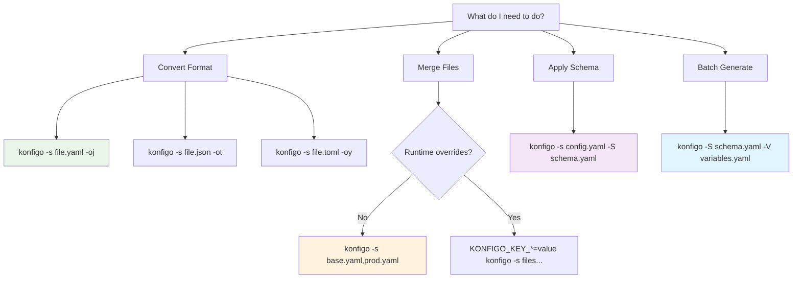

# CLI Reference

Complete command-line reference for Konfigo. Start with the essentials, then explore advanced options as needed.

## Command Decision Tree

Choose the right command pattern for your task:


```mermaid
graph TD
    A[What do I need to do?] --> B[Convert Format]
    A --> C[Merge Files]
    A --> D[Apply Schema]
    A --> E[Batch Generate]

    B --> B1[konfigo -s file.yaml -oj]
    B --> B2[konfigo -s file.json -ot]
    B --> B3[konfigo -s file.toml -oy]

    C --> C1{Runtime overrides?}
    C1 -->|No| C2[konfigo -s base.yaml,prod.yaml]
    C1 -->|Yes| C3[KONFIGO_KEY_*=value konfigo -s files...]

    D --> D1[konfigo -s config.yaml -S schema.yaml]

    E --> E1[konfigo -S schema.yaml -V variables.yaml]

    style B1 fill:#e8f5e8
    style C2 fill:#fff3e0
    style D1 fill:#f3e5f5
    style E1 fill:#e1f5fe
```

## Essential Commands

These commands handle 90% of common use cases:

```bash
# Merge configurations
konfigo -s base.yaml,prod.yaml

# Output to file
konfigo -s config.yaml -of final.json

# Convert formats
konfigo -s config.yaml -oj              # YAML to JSON
konfigo -s config.json -oy              # JSON to YAML

# Use environment overrides
KONFIGO_KEY_app.port=9000 konfigo -s config.yaml

# Apply schema processing
konfigo -s config.yaml -S schema.yaml

# Batch generation
konfigo -s base.yaml -S schema.yaml -V variables.yaml
```

## Quick Reference

| Task | Command | Notes |
|------|---------|--------|
| **Basic merge** | `konfigo -s file1.yaml,file2.json` | Merge multiple files |
| **Format conversion** | `konfigo -s config.yaml -oj` | Convert YAML to JSON |
| **Save output** | `konfigo -s config.yaml -of result.json` | Save to file |
| **Environment override** | `KONFIGO_KEY_app.port=8080 konfigo -s config.yaml` | Override any value |
| **Schema processing** | `konfigo -s config.yaml -S schema.yaml` | Apply schema |
| **Batch generation** | `konfigo -s base.yaml -V vars.yaml` | Generate multiple outputs |
| **Debug output** | `konfigo -v -s config.yaml` | See what's happening |

---

## Command Structure

```bash
konfigo [flags] -s <sources> [output-flags]
```

Positional arguments are also supported:

```bash
konfigo file1.yaml file2.json
```

### Examples by Use Case

#### **Configuration Merging**
```bash
# Basic merge
konfigo -s base.yaml,env.yaml,local.yaml

# With output file
konfigo -s base.yaml,prod.yaml -of production.json

# Recursive directory merge
konfigo -r -s configs/ -of merged.yaml

# Case-sensitive merging
konfigo -c -s config1.yaml,config2.yaml
```

#### **Format Conversion**
```bash
# Single format output
konfigo -s config.yaml -oj                    # -> JSON
konfigo -s config.json -oy                    # -> YAML
konfigo -s config.toml -oe                    # -> ENV

# Multiple format output
konfigo -s config.yaml -oj -oy -ot -of base   # -> base.json, base.yaml, base.toml
```

#### **Environment Integration**
```bash
# Single override
KONFIGO_KEY_database.host=prod-db konfigo -s config.yaml

# Multiple overrides
KONFIGO_KEY_app.port=9000 KONFIGO_KEY_app.debug=false konfigo -s config.yaml

# From environment file
source .env && konfigo -s config.yaml
```

#### **Schema Processing**
```bash
# Basic schema application
konfigo -s config.yaml -S schema.yaml

# With variables
konfigo -s config.yaml -S schema.yaml -V variables.yaml

# Batch processing
konfigo -s template.yaml -S schema.yaml -V batch-vars.yaml
```

---

## Input Sources (`-s`)

Specify configuration sources to merge.

### Syntax
```bash
-s <source1>[,<source2>,...]
```

### Source Types

| Type | Example | Notes |
|------|---------|--------|
| **File** | `-s config.yaml` | Single configuration file |
| **Multiple files** | `-s base.yaml,prod.yaml` | Comma-separated list |
| **Directory** | `-s configs/` | All files in directory |
| **Recursive** | `-r -s configs/` | Include subdirectories |
| **Stdin** | `-s -` | Read from standard input |

### Format Detection

Konfigo automatically detects formats by extension:

| Extension | Format |
|-----------|--------|
| `.json` | JSON |
| `.yaml`, `.yml` | YAML |
| `.toml` | TOML |
| `.env` | ENV |
| `.ini` | INI (input only) |

### Explicit Format Flags

Override automatic detection (required for stdin):

```bash
konfigo -sj -s data.txt      # Treat as JSON
konfigo -sy -s config.conf   # Treat as YAML
konfigo -st -s settings.txt  # Treat as TOML
konfigo -se -s vars.txt      # Treat as ENV
```

### Source Options

```bash
# Recursive directory processing
konfigo -r -s configs/

# Case-sensitive key merging
konfigo -c -s config1.yaml,config2.yaml
```

---

## Schema Processing (`-S, --schema`)

Apply schema-driven processing for validation, transformation, and advanced features.

### Basic Usage
```bash
konfigo -s config.yaml -S schema.yaml
```

### Schema Capabilities

| Feature | Description | Example |
|---------|-------------|---------|
| **Validation** | Enforce data constraints | Required fields, type checking |
| **Variables** | Template substitution | `${DATABASE_HOST}` |
| **Transformation** | Modify data structure | Rename keys, change values |
| **Generation** | Create new data | IDs, timestamps |
| **Batch processing** | Multiple outputs | Environment-specific configs |

### Schema with Variables
```bash
# Variables from file
konfigo -s config.yaml -S schema.yaml -V variables.yaml

# Variables from environment (KONFIGO_VAR_*)
KONFIGO_VAR_ENV=prod konfigo -s config.yaml -S schema.yaml
```

---

## Output Control

### Output Formats

```bash
# Format flags (can combine multiple)
-oj         # JSON output
-oy         # YAML output
-ot         # TOML output
-oe         # ENV output
```

### Output Destinations

```bash
# Output to file
-of <filename>

# Output to stdout (default)
# No flag needed
```

### Examples
```bash
# Single format to file
konfigo -s config.yaml -oj -of result.json

# Multiple formats with base name
konfigo -s config.yaml -oj -oy -ot -of config
# Creates: config.json, config.yaml, config.toml
```

---

## Environment Variables

### Configuration Overrides (`KONFIGO_KEY_*`)

Override any configuration value:

```bash
# Simple values
KONFIGO_KEY_app.port=8080
KONFIGO_KEY_database.host=localhost

# Nested structures
KONFIGO_KEY_database.connection.pool_size=20
KONFIGO_KEY_features.auth.enabled=true
```

### Schema Variables (`KONFIGO_VAR_*`)

Supply variables for schema processing:

```bash
# Set variables for schema substitution
KONFIGO_VAR_ENVIRONMENT=production
KONFIGO_VAR_DATABASE_HOST=prod-db.company.com

konfigo -s config.yaml -S schema.yaml
```

---

## Flags

Flags are used to control Konfigo's behavior, from specifying input sources and output formats to enabling schema processing and managing logging.

### Input & Sources

*   `-s <paths>`:
    *   **Description**: A comma-separated list of source files or directories. Konfigo will read and merge these sources in the order they are provided (last source wins for overlapping keys).
    *   Use `-` to specify reading from standard input (stdin). When using stdin, you **must** also specify the input format using one of the `-s<format>` flags (e.g., `-sy` for YAML).
    *   **Example**: `konfigo -s base.json,env/dev.yml,secrets.env`
    *   **Example (stdin)**: `cat my_config.json | konfigo -s - -sj`

*   `-r`:
    *   **Description**: Recursively search for configuration files in subdirectories of any directories specified in `-s`.
    *   Konfigo identifies files by common configuration extensions (`.json`, `.yaml`, `.yml`, `.toml`, `.env`, `.ini`).
    *   **Example**: `konfigo -s ./configs -r`

*   `-sj`:
    *   **Description**: Force input to be parsed as JSON.
    *   This is **required** if reading JSON content from stdin (`-s -`).
    *   **Example**: `echo '{"key": "value"}' | konfigo -s - -sj`

*   `-sy`:
    *   **Description**: Force input to be parsed as YAML.
    *   This is **required** if reading YAML content from stdin (`-s -`).
    *   **Example**: `echo 'key: value' | konfigo -s - -sy`

*   `-st`:
    *   **Description**: Force input to be parsed as TOML.
    *   This is **required** if reading TOML content from stdin (`-s -`).
    *   **Example**: `echo 'key = "value"' | konfigo -s - -st`

*   `-se`:
    *   **Description**: Force input to be parsed as an ENV file.
    *   This is **required** if reading ENV content from stdin (`-s -`).
    *   **Example**: `echo 'KEY=value' | konfigo -s - -se`

### Schema & Variables

*   `-S, --schema <path>`:
    *   **Description**: Path to a schema file (must be YAML, JSON, or TOML). This schema defines how the merged configuration should be processed, including variable resolution, data generation, transformations, and validation.
    *   Refer to the [Schema Documentation](../schema/index.md) for details on schema structure and capabilities.
    *   **Example**: `konfigo -s config.yml -S schema.yml`

*   `-V, --vars-file <path>`:
    *   **Description**: Path to a file (YAML, JSON, or TOML) providing high-priority variables for substitution within your schema and configuration.
    *   Variables from this file override those defined in the schema's `vars` block but are themselves overridden by `KONFIGO_VAR_...` environment variables.
    *   This file can also contain the `forEach` directive for batch processing.
    *   **Example**: `konfigo -s config.yml -S schema.yml -V prod-vars.yml`
    *   See [Variable Precedence](#variable-precedence) and [Batch Processing with `forEach`](../schema/variables.md#batch-processing-with-foreach) for more details.

#### Variable Precedence

Konfigo resolves variables used in `${VAR_NAME}` substitutions with the following priority (1 is highest):

1.  **Environment Variables**: Set as `KONFIGO_VAR_VARNAME=value`. (See [Environment Variables](./environment-variables.md))
2.  **Variables File**: Variables defined in the file specified by `-V` or `--vars-file`.
    *   In batch mode (`forEach`), iteration-specific variables take precedence over global variables within this file.
3.  **Schema `vars` Block**: Variables defined within the `vars:` section of the schema file specified by `-S`.

### Output & Formatting

*   `-of <path>`:
    *   **Description**: Write the final processed configuration to the specified file path.
    *   If the filename has an extension (e.g., `.json`, `.yaml`, `.toml`, `.env`), Konfigo will use that extension to determine the output format.
    *   If used in conjunction with specific format flags (`-oj`, `-oy`, etc.), this path acts as a base name, and the format flag's extension will be appended. For example, `konfigo -s c.json -of out/config -oy` would write to `out/config.yaml`.
    *   If this flag is not provided, output is sent to standard output (stdout), defaulting to YAML format unless overridden by an `-o<format>` flag.
    *   **Example (extension determines format)**: `konfigo -s c.json -of config.yaml`
    *   **Example (used as base name)**: `konfigo -s c.json -of config -oj -oy` (writes `config.json` and `config.yaml`)

*   `-oj`:
    *   **Description**: Output the final configuration in JSON format.
    *   **Example**: `konfigo -s c.yml -oj` (outputs JSON to stdout)

*   `-oy`:
    *   **Description**: Output the final configuration in YAML format. This is the default output format if no other output flags are specified.
    *   **Example**: `konfigo -s c.json -oy` (outputs YAML to stdout)

*   `-ot`:
    *   **Description**: Output the final configuration in TOML format.
    *   **Example**: `konfigo -s c.json -ot` (outputs TOML to stdout)

*   `-oe`:
    *   **Description**: Output the final configuration in ENV file format.
    *   **Example**: `konfigo -s c.json -oe` (outputs ENV to stdout)

### Behavior & Logging

*   `-c`:
    *   **Description**: Use case-sensitive key matching during merging.
    *   By default, Konfigo performs case-insensitive key matching (e.g., `key` and `Key` would be treated as the same key, with the latter overriding the former if it appears later in the merge sequence).
    *   **Example**: `konfigo -s config.json -c`

*   `-v`:
    *   **Description**: Enable verbose (INFO) logging. Shows processing steps and decision points.
    *   Overrides default quiet behavior but is overridden by `-d`.
    *   **Example**: `konfigo -s config.json -v`

*   `-d`:
    *   **Description**: Enable debug (DEBUG + INFO) logging. Shows detailed internal processing information.
    *   Most verbose logging level, overrides both `-v` and default quiet behavior.
    *   **Example**: `konfigo -s config.json -d`

*   `-h`:
    *   **Description**: Show the help message with a summary of all available flags and basic usage instructions.
    *   **Example**: `konfigo -h`

## Advanced Usage Patterns

### Multiple Source Patterns

```bash
# Mixed file types
konfigo -s base.yaml,overrides.json,secrets.env

# Directory with specific files
konfigo -s configs/,local/dev.yaml

# Recursive discovery
konfigo -s ./configs -r

# Stdin combined with files
cat dynamic.yaml | konfigo -s base.yaml,- -sy
```

### Output Control Patterns

```bash
# Multiple output formats
konfigo -s config.yaml -oj -oy -ot -oe

# File output with stdout
konfigo -s config.yaml -of final.json -oy

# Conditional output based on extension
konfigo -s config.yaml -of final.json    # JSON format (from extension)
konfigo -s config.yaml -of final -oj     # JSON format (from flag)
```

### Schema and Variable Combinations

```bash
# Schema processing
konfigo -s config.yaml -S validation-schema.yaml

# Variables without schema
export KONFIGO_VAR_ENV=production
konfigo -s config.yaml

# Complete processing pipeline
konfigo -s base.yaml,env.yaml -S full-schema.yaml -V variables.yaml

# Batch processing
konfigo -s template.yaml -S schema.yaml -V batch-definitions.yaml
```

### Environment Variable Patterns

```bash
# Direct configuration overrides
export KONFIGO_KEY_database.host="prod-db.example.com"
export KONFIGO_KEY_app.debug=false
konfigo -s config.yaml

# Schema variable overrides
export KONFIGO_VAR_ENVIRONMENT="production"
export KONFIGO_VAR_VERSION="v1.2.3"
konfigo -s config.yaml -S schema.yaml

# Combined approach
export KONFIGO_KEY_app.replicas=5           # Direct override
export KONFIGO_VAR_NAMESPACE="production"   # Schema variable
konfigo -s config.yaml -S k8s-schema.yaml -V prod-vars.yaml
```

## Exit Codes

Konfigo uses standard exit codes to indicate the result of operations:

*   **0**: Successful execution - all operations completed without errors
*   **1**: General error - file not found, parsing failed, permission denied
*   **2**: Validation error - schema validation failed, constraint violations
*   **3**: Schema processing error - transformation or generation failures
*   **4**: Environment/variable error - missing required variables or invalid values

### Exit Code Usage in Scripts

```bash
#!/bin/bash

# Check if configuration is valid
if konfigo -s config.yaml -S validation.yaml >/dev/null 2>&1; then
    echo "Configuration is valid"
else
    case $? in
        1) echo "File or parsing error" ;;
        2) echo "Validation failed" ;;
        3) echo "Schema processing error" ;;
        4) echo "Variable/environment error" ;;
        *) echo "Unknown error" ;;
    esac
    exit 1
fi

# Generate production configuration
konfigo -s base.yaml,prod.yaml -S prod-schema.yaml -of prod-config.yaml
```

## Piping and Streams

```bash
# Read from stdin
echo '{"key": "value"}' | konfigo -s - -sj -oy

# Chain with other tools
curl -s api.com/config | konfigo -s - -sj -S schema.yaml | jq '.app'

# Process multiple streams
cat config1.json | konfigo -s -,config2.yaml -sj -of merged.yaml
```

## Integration Examples

### CI/CD Integration

```bash
# Validate in CI pipeline
konfigo -s configs/ -r -S validation-schema.yaml || exit 1

# Generate deployment configs
for env in dev staging prod; do
    konfigo -s base.yaml,envs/$env.yaml -S deploy-schema.yaml -V vars/$env.yaml -of deploy-$env.yaml
done
```

### Docker Integration

```dockerfile
# Multi-stage build with config generation
FROM konfigo:latest as config-builder
COPY configs/ /configs/
COPY schemas/ /schemas/
RUN konfigo -s /configs/ -r -S /schemas/app.yaml -of /app-config.yaml

FROM alpine:latest
COPY --from=config-builder /app-config.yaml /etc/app/config.yaml
```

### Kubernetes Integration

```bash
# Generate ConfigMap from multiple sources
konfigo -s base.yaml,k8s-overrides.yaml -S k8s-schema.yaml | \
    kubectl create configmap app-config --from-file=/dev/stdin --dry-run=client -o yaml
```

## Debugging

### Debug Mode Usage

Always start troubleshooting with debug mode:

```bash
# See what Konfigo is doing
konfigo -d -s config.yaml -S schema.yaml

# Check specific processing stages
konfigo -v -s config.yaml                    # Merge only
konfigo -v -s config.yaml -S schema.yaml     # With schema
```

### Validation Issues

```bash
# Test components individually
konfigo -s config.yaml                       # Test merging
konfigo -s config.yaml -S validation.yaml    # Test validation
yamllint config.yaml                         # Test YAML syntax
```

### Environment Variable Issues

```bash
# Check environment variables
env | grep KONFIGO_
echo "KONFIGO_KEY_app.port=$KONFIGO_KEY_app.port"
echo "KONFIGO_VAR_ENV=$KONFIGO_VAR_ENV"
```

## Quick Troubleshooting

| Problem | Solution |
|---------|----------|
| **Command not found** | Check installation and PATH |
| **Permission denied** | Check file permissions |
| **Invalid YAML** | Validate syntax with `yamllint` |
| **Schema errors** | Use `-v` or `-d` to debug |

## Next Steps

- **[User Guide](./index.md)** - Task-oriented guides
- **[Recipes & Examples](./recipes.md)** - Real-world patterns
- **[Schema Guide](../schema/)** - Advanced processing
- **[Troubleshooting](../reference/troubleshooting.md)** - Detailed problem solving

This CLI reference covers all Konfigo capabilities. Start with the essentials and gradually explore advanced features as your needs grow!
