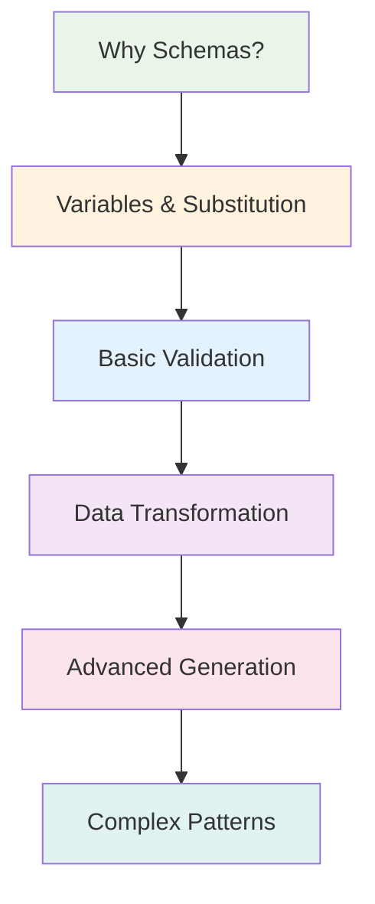

# Schema Guide: Unlock Konfigo's Full Power

Schemas transform Konfigo from a simple configuration merger into a powerful configuration processing engine. This guide takes you from schema basics to advanced features step by step.

## Why Use Schemas?

Without schemas, Konfigo merges and converts configurations. **With schemas**, you can:

- ✅ **Validate configurations** before deployment
- ✅ **Substitute variables** for environment-specific values  
- ✅ **Transform data structures** during processing
- ✅ **Generate new data** like UUIDs and timestamps
- ✅ **Create multiple outputs** from single templates
- ✅ **Enforce constraints** and business rules

**Think of schemas as configuration recipes** - they tell Konfigo exactly how to process your data.

## Learning Path



## Quick Start: Your First Schema

Let's start with a simple example to see schemas in action.

### Without Schema (Basic Merge)

```bash
# Basic merge - just combines files
konfigo -s base.yaml,prod.yaml
```

### With Schema (Powerful Processing)

**1. Create a simple schema (`simple.schema.yaml`)**:
```yaml
# simple.schema.yaml
apiVersion: v1
vars:
  - name: "ENVIRONMENT"
    value: "production"
  - name: "DATABASE_HOST"
    value: "prod-db.company.com"

validation:
  - path: "app.port"
    required: true
    type: "number"
    min: 1024
    max: 65535
    
transforms:
  - path: "database.url"
    setValue: "postgres://${DATABASE_HOST}:5432/myapp"
```

**2. Apply the schema**:
```bash
konfigo -s base.yaml,prod.yaml -S simple.schema.yaml
```

**What just happened?**
- Variables were substituted (`${DATABASE_HOST}`)
- Port was validated (must be 1024-65535)
- Database URL was generated automatically
- All while merging your configurations!

## Schema Structure Overview

Every schema is a YAML/JSON/TOML file with these main sections:

```yaml
# Complete schema structure (all sections optional)

# Schema metadata
apiVersion: "konfigo/v1alpha1"

# Input validation (before processing)
inputSchema:
  path: "input-validation.yaml"
  strict: false

# Output filtering (after processing)  
outputSchema:
  path: "output-schema.yaml"
  strict: false

# Protected configuration paths
immutable:
  - "app.name"
  - "security.keys"

# Variable definitions
vars:
  - name: "ENV"
    value: "production"

# Data generation rules
generation:
  - path: "app.id"
    uuid: true

# Data transformation rules
transforms:
  - path: "database.url"
    setValue: "postgres://${DB_HOST}:5432/${DB_NAME}"

# Validation rules
validation:
  - path: "app.port"
    required: true
    type: "number"
    min: 1024
```

**Don't worry!** You don't need all sections. Start with what you need and add more as you grow.

## Progressive Examples

### Level 1: Variables Only

**Problem**: Different database hosts for different environments

```yaml
# config.yaml
app:
  name: "my-service"
database:
  host: "PLACEHOLDER"  # We want to replace this
  port: 5432
```

**Schema**:
```yaml
# variables.schema.yaml
vars:
  - name: "DB_HOST"
    value: "prod-db.company.com"

transforms:
  - path: "database.host"
    setValue: "${DB_HOST}"
```

**Command**:
```bash
konfigo -s config.yaml -S variables.schema.yaml
```

**Result**:
```yaml
app:
  name: "my-service"
database:
  host: "prod-db.company.com"  # ← Substituted!
  port: 5432
```

### Level 2: Basic Validation

**Problem**: Ensure configuration is valid before deployment

```yaml
# Add validation to the schema
vars:
  - name: "DB_HOST"
    value: "prod-db.company.com"

transforms:
  - path: "database.host"
    setValue: "${DB_HOST}"

validation:
  - path: "app.name"
    required: true
    type: "string"
    minLength: 3
  - path: "database.port"
    required: true
    type: "number"
    min: 1
    max: 65535
```

Now Konfigo will **validate** that:
- App name exists and is at least 3 characters
- Database port is a valid number between 1-65535

### Level 3: Data Generation

**Problem**: Generate unique IDs and timestamps

```yaml
# Enhanced schema with generation
vars:
  - name: "DB_HOST"
    value: "prod-db.company.com"

generation:
  - path: "app.instance_id"
    uuid: true
  - path: "deployment.timestamp"
    timestamp: true
  - path: "deployment.version"
    concat:
      - "v1.0.0-"
      - "${BUILD_NUMBER}"

transforms:
  - path: "database.host"
    setValue: "${DB_HOST}"

validation:
  - path: "app.name"
    required: true
```

**Result adds**:
```yaml
app:
  instance_id: "550e8400-e29b-41d4-a716-446655440000"
deployment:
  timestamp: "2024-01-15T10:30:00Z"
  version: "v1.0.0-123"
```

### Level 4: Multiple Outputs (Batch Processing)

**Problem**: Generate configs for multiple environments from one template

**Variables file (`environments.yaml`)**:
```yaml
konfigo_forEach:
  - name: "dev"
    vars:
      DB_HOST: "dev-db.company.com"
      ENVIRONMENT: "development"
      DEBUG: true
  - name: "prod"
    vars:
      DB_HOST: "prod-db.company.com"
      ENVIRONMENT: "production"
      DEBUG: false
```

**Command**:
```bash
konfigo -s template.yaml -S schema.yaml -V environments.yaml
```

**Creates**: `dev.yaml` and `prod.yaml` with environment-specific values!

## When to Use Each Feature

| Feature | Use When | Example |
|---------|----------|---------|
| **Variables** | Values change between environments | Database hosts, API keys |
| **Validation** | Prevent deployment errors | Required fields, value ranges |
| **Transformation** | Modify data during processing | URL generation, key renaming |
| **Generation** | Create dynamic values | UUIDs, timestamps, computed values |
| **Batch processing** | Multiple similar configs needed | Multi-environment, microservices |

## Real-World Schema Patterns

### 1. **Environment-Specific Deployment**
```yaml
vars:
  - name: "ENV"
    required: true  # Must be set via KONFIGO_VAR_ENV
  - name: "DB_HOST"
    fromPath: "environments.${ENV}.database.host"

validation:
  - path: "app.replicas"
    type: "number"
    min: 1
    max: "${ENV == 'prod' ? 10 : 3}"
```

### 2. **Microservices Configuration**
```yaml
generation:
  - path: "service.id"
    uuid: true
  - path: "service.discovery_name"
    concat: ["${SERVICE_NAME}", "-", "${ENVIRONMENT}"]

transforms:
  - path: "monitoring.service_name"
    setValue: "${SERVICE_NAME}"
  - path: "database.name"
    setValue: "${SERVICE_NAME}_${ENVIRONMENT}"
```

### 3. **Configuration Validation Pipeline**
```yaml
inputSchema:
  strict: true

validation:
  - path: "security.api_keys"
    required: true
    type: "array"
    minItems: 1
  - path: "database.ssl"
    required: true
    equals: true  # Must be true in production

immutable:
  - "security"
  - "app.name"
```

## Common Schema Patterns

### **Environment Variables Integration**
```yaml
vars:
  - name: "DB_PASSWORD"
    fromEnv: "DATABASE_PASSWORD"  # From environment variable
  - name: "API_KEY"
    fromEnv: "SECRET_API_KEY"
```

### **Conditional Logic**
```yaml
transforms:
  - path: "app.debug"
    setValue: "${ENVIRONMENT != 'production'}"
  - path: "logging.level"
    setValue: "${ENVIRONMENT == 'production' ? 'info' : 'debug'}"
```

### **Complex URL Generation**
```yaml
generation:
  - path: "database.url"
    concat:
      - "postgres://"
      - "${DB_USER}:${DB_PASSWORD}"
      - "@${DB_HOST}:${DB_PORT}"
      - "/${DB_NAME}"
      - "?sslmode=${DB_SSL ? 'require' : 'disable'}"
```

## Schema Best Practices

### 1. **Start Simple**
Begin with variables and basic validation. Add complexity gradually.

### 2. **Use Meaningful Names**
```yaml
# ✅ Good
vars:
  - name: "DATABASE_HOST"
  - name: "API_TIMEOUT_SECONDS"

# ❌ Avoid
vars:
  - name: "X"
  - name: "CONFIG1"
```

### 3. **Validate Early**
Put validation rules at the beginning of your schema development process.

### 4. **Document Complex Schemas**
```yaml
# complex.schema.yaml
# This schema generates microservice configurations
# Variables: SERVICE_NAME, ENVIRONMENT (required)
# Outputs: Service config with monitoring and database setup

vars:
  - name: "SERVICE_NAME"
    required: true
    description: "Name of the microservice"
```

### 5. **Test Your Schemas**
```bash
# Always test schemas with sample data
konfigo -s test-config.yaml -S your-schema.yaml --validate-only
```

## Quick Reference

| Task | Schema Section | Example |
|------|----------------|---------|
| **Set variables** | `vars:` | `- name: "ENV" value: "prod"` |
| **Validate fields** | `validation:` | `- path: "port" type: "number"` |
| **Transform data** | `transforms:` | `- path: "url" setValue: "${HOST}"` |
| **Generate UUIDs** | `generation:` | `- path: "id" uuid: true` |
| **Batch outputs** | Use `-V` with `konfigo_forEach` | See batch examples |
| **Protect fields** | `immutable:` | `- "security.keys"` |

## Next Steps

Ready to dive deeper? Here's your learning path:

### **Master the Basics** (30 minutes)
- **[Variables & Substitution](./variables.md)** - Template your configurations
- **[Basic Validation](./validation.md)** - Prevent configuration errors

### **Advanced Features** (1-2 hours)
- **[Data Transformation](./transformation.md)** - Modify and reshape data
- **[Data Generation](./generation.md)** - Create dynamic values
- **[Advanced Features](./advanced.md)** - Complex patterns and optimization

### **Real-World Application**
- **[User Guide Examples](../guide/recipes.md)** - See schemas in action
- **[CLI Reference](../guide/cli-reference.md)** - Command-line options for schemas

## Questions?

- **Schema not working?** Check [Troubleshooting](../reference/troubleshooting.md)
- **Need inspiration?** Browse [Recipes & Examples](../guide/recipes.md)
- **Want to contribute?** See [Best Practices](../reference/best-practices.md)

Schemas unlock Konfigo's full potential. Start with simple variable substitution, then gradually add validation and transformation as your needs grow!
    fromEnv: "DB_HOST"
    defaultValue: "localhost"

# Optional: Generate new configuration data
generators:
  - type: "concat"
    targetPath: "service.url"
    format: "https://{name}.${DOMAIN}:{port}"
    sources:
      name: "service.name"
      port: "service.port"

# Optional: Transform existing configuration
transform:
  - type: "renameKey"
    from: "legacy.api_url"
    to: "service.endpoint"
  - type: "changeCase"
    path: "service.environment"
    case: "upper"

# Optional: Validate final configuration
validate:
  - path: "service.port"
    rules:
      required: true
      type: "number"
      min: 1024
      max: 65535
```

## Processing Pipeline

Konfigo processes schemas in a specific order:

1. **Input Validation** ([`inputSchema`](./advanced.md#input-schema-validation)): Validate merged configuration structure
2. **Variable Resolution** ([`vars`](./variables.md)): Define and resolve variables from multiple sources
3. **Data Generation** ([`generators`](./generation.md)): Create new configuration values
4. **Transformation** ([`transform`](./transformation.md)): Modify configuration structure and content
5. **Variable Substitution**: Replace `${VAR_NAME}` placeholders throughout configuration
6. **Validation** ([`validate`](./validation.md)): Enforce rules and constraints
7. **Output Filtering** ([`outputSchema`](./advanced.md#output-schema-filtering)): Filter final output structure
8. **Immutable Protection** ([`immutable`](./advanced.md#immutable-fields)): Applied during merging, protects paths throughout

## Core Schema Blocks

### Required Blocks
None - all schema blocks are optional, enabling gradual adoption.

### Variable System ([`vars`](./variables.md))
Define dynamic values with multiple resolution sources:

```yaml
vars:
  # Literal values
  - name: "APP_NAME"
    value: "my-service"
  
  # Environment variables with fallbacks
  - name: "DB_PASSWORD"
    fromEnv: "DATABASE_PASSWORD"
    defaultValue: "default-pass"
  
  # Values from configuration paths
  - name: "NAMESPACE"
    fromPath: "deployment.namespace"
    defaultValue: "default"
```

**Variable Precedence:** Environment (`KONFIGO_VAR_*`) > Variables File (`-V`) > Schema vars

### Data Generation ([`generators`](./generation.md))
Create new configuration values dynamically:

```yaml
generators:
  - type: "concat"
    targetPath: "database.connectionString"
    format: "postgresql://{user}:${PASSWORD}@{host}:{port}/{db}"
    sources:
      user: "database.username"
      host: "database.host" 
      port: "database.port"
      db: "database.name"
```

### Transformation ([`transform`](./transformation.md))
Modify configuration structure and content:

```yaml
transform:
  # Rename configuration keys
  - type: "renameKey"
    from: "old.config.path"
    to: "new.config.path"
  
  # Change string case
  - type: "changeCase"
    path: "service.environment"
    case: "upper"
  
  # Set new values
  - type: "setValue"
    path: "metadata.processed"
    value: true
  
  # Add prefixes to all keys in a map
  - type: "addKeyPrefix"
    path: "environment.variables"
    prefix: "APP_"
```

### Validation ([`validate`](./validation.md))
Enforce configuration rules and constraints:

```yaml
validate:
  # Required string with pattern
  - path: "service.name"
    rules:
      required: true
      type: "string"
      minLength: 3
      regex: "^[a-zA-Z][a-zA-Z0-9_-]*$"
  
  # Numeric ranges
  - path: "service.port"
    rules:
      type: "number"
      min: 1024
      max: 65535
  
  # Enumerated values
  - path: "environment"
    rules:
      type: "string"
      enum: ["development", "staging", "production"]
```

## Advanced Features ([Advanced](./advanced.md))

### Immutable Fields
Protect critical configuration from being overwritten:

```yaml
immutable:
  - "service.name"
  - "database.credentials.username"
  - "security.apiKey"
```

### Input Schema Validation
Validate merged configuration before processing:

```yaml
inputSchema:
  path: "./schemas/expected-input.yaml"
  strict: false  # Allow extra keys
```

### Output Schema Filtering
Filter final output to include only specified keys:

```yaml
outputSchema:
  path: "./schemas/public-api.yaml"
  strict: false  # Include only keys from schema
```

## Complete Example

Here's a comprehensive schema demonstrating all features:

```yaml
apiVersion: "konfigo/v1alpha1"

# Validate input structure
inputSchema:
  path: "./schemas/input-requirements.yaml"
  strict: false

# Define output structure
outputSchema:
  path: "./schemas/public-output.yaml"
  strict: false

# Protect critical paths
immutable:
  - "service.name"
  - "database.credentials"

# Define variables
vars:
  - name: "ENVIRONMENT"
    fromEnv: "NODE_ENV"
    defaultValue: "development"
  
  - name: "API_VERSION"
    fromPath: "metadata.version"
    defaultValue: "1.0.0"
  
  - name: "DATABASE_PASSWORD"
    fromEnv: "DB_PASS"
    defaultValue: "default-password"

# Generate configuration
generators:
  - type: "concat"
    targetPath: "service.url"
    format: "https://{name}-${ENVIRONMENT}.example.com"
    sources:
      name: "service.name"
  
  - type: "concat"
    targetPath: "database.connectionString"
    format: "postgresql://user:${DATABASE_PASSWORD}@{host}:5432/{db}"
    sources:
      host: "database.host"
      db: "database.name"

# Transform configuration
transform:
  - type: "renameKey"
    from: "legacy.api_endpoint"
    to: "service.endpoint"
  
  - type: "changeCase"
    path: "service.environment"
    case: "upper"
  
  - type: "setValue"
    path: "metadata.processedAt"
    value: "2024-06-26T10:30:00Z"
  
  - type: "addKeyPrefix"
    path: "features"
    prefix: "FEATURE_"

# Validate final configuration
validate:
  - path: "service.name"
    rules:
      required: true
      type: "string"
      minLength: 3
  
  - path: "service.port"
    rules:
      required: true
      type: "number"
      min: 1024
      max: 65535
  
  - path: "database.connectionString"
    rules:
      required: true
      type: "string"
      regex: "^postgresql://"
```

## Schema Development Workflow

1. **Start Simple**: Begin with basic variable definitions
2. **Add Generation**: Introduce generators for dynamic values
3. **Transform Legacy**: Use transformations to modernize configuration structure
4. **Validate Quality**: Add validation rules to ensure configuration integrity
5. **Secure Output**: Use advanced features for production security

## Best Practices

### ✅ Do's

**Start simple and grow incrementally**
```yaml
# Good: Begin with basic variables
vars:
  - name: "ENVIRONMENT"
    value: "production"

# Then add validation as needed
validate:
  - path: "app.port"
    rules:
      required: true
      type: "number"
```

**Use clear, descriptive variable names**
```yaml
# Good: Self-documenting
vars:
  - name: "DATABASE_PRIMARY_HOST"
    value: "prod-db-primary.company.com"
  - name: "REDIS_CACHE_URL"
    value: "redis://cache.company.com:6379"

# Bad: Cryptic names
vars:
  - name: "DB1"
    value: "prod-db-primary.company.com"
  - name: "R1"
    value: "redis://cache.company.com:6379"
```

**Group related configuration logically**
```yaml
# Good: Logical organization
vars:
  # Database configuration
  - name: "DB_HOST"
    value: "prod-db.company.com"
  - name: "DB_PORT"
    value: "5432"
  
  # Service configuration  
  - name: "SERVICE_PORT"
    value: "8080"
  - name: "SERVICE_TIMEOUT"
    value: "30s"
```

**Validate critical configurations**
```yaml
# Good: Validate what matters
validate:
  - path: "database.port"
    rules:
      required: true
      type: "number"
      min: 1024
      max: 65535
  - path: "environment"
    rules:
      required: true
      enum: ["development", "staging", "production"]
```

**Use environment variables for secrets**
```bash
# Good: Secrets from environment
KONFIGO_VAR_DB_PASSWORD=$SECRET_PASSWORD \
KONFIGO_VAR_API_KEY=$SECRET_API_KEY \
konfigo -s config.yaml -S schema.yaml
```

### ❌ Don'ts

**Don't put secrets in schema files**
```yaml
# Bad: Secrets in version control
vars:
  - name: "DATABASE_PASSWORD"
    value: "supersecret123"  # Never do this!
  - name: "API_KEY"  
    value: "sk-abc123xyz789"  # Security risk!
```

**Don't over-validate**
```yaml
# Bad: Excessive validation slows processing
validate:
  - path: "app.name"
    rules:
      type: "string"
      minLength: 1
      maxLength: 100
      regex: "^[a-zA-Z0-9_-]+$"
  - path: "app.description"  # Not critical, no need to validate
    rules:
      type: "string"
      minLength: 1
      maxLength: 1000
```

**Don't create complex nested transformations**
```yaml
# Bad: Hard to understand and maintain
transform:
  - type: "renameKey"
    from: "old.deeply.nested.config.value"
    to: "new.deeply.nested.different.value"
  - type: "changeCase"
    path: "new.deeply.nested.different.value"
    case: "upper"
  - type: "addPrefix"
    path: "new.deeply.nested.different.value"
    prefix: "TRANSFORMED_"
```

**Don't mix schema concerns**
```yaml
# Bad: Everything in one schema
vars: [...]           # Variables
validate: [...]       # Validation
transform: [...]      # Transformation
generators: [...]     # Generation
# Too much in one file!

# Good: Separate by purpose
# variables.schema.yaml - Just variables
# validation.schema.yaml - Just validation  
# transforms.schema.yaml - Just transformations
```

### ⚠️ Common Pitfalls

::: warning Variable Precedence
Environment variables override schema variables. Don't assume schema vars will always be used:

```yaml
# This schema variable might be overridden
vars:
  - name: "PORT"
    value: "8080"

# This environment variable wins:
# KONFIGO_VAR_PORT=9090
```
:::

::: warning Immutable vs Environment Variables
Immutable paths don't protect against environment variable overrides:

```yaml
immutable:
  - "service.name"     # Protects from file overrides

# But this still works:
# KONFIGO_KEY_service.name=override
```
:::

::: warning Validation Order
Validation happens after merging and transformation. Variables must be substituted first:

```yaml
# This won't work if PORT is a variable
validate:
  - path: "app.port"
    rules:
      type: "number"    # Validation sees "${PORT}", not the substituted value
```
:::

### 📚 Learning Resources

1. **Incremental Adoption**: Add schema features gradually
2. **Test Thoroughly**: Verify schema behavior with various input configurations
3. **Document Variables**: Comment variable sources and purposes
4. **Validate Early**: Use input schema validation to catch issues early
5. **Secure Secrets**: Use environment variables (`KONFIGO_VAR_*`) for sensitive data
6. **Version Schemas**: Use `apiVersion` for schema evolution tracking

```yaml
# Main schema.yml
inputSchema:
  path: "./schemas/expected_input_structure.json"
  strict: true
outputSchema:
  path: "./schemas/final_output_structure.json"

# ... other schema directives (vars, generators, etc.) ...
```

### `immutable`

A list of dot-separated configuration paths that should resist changes from subsequent configuration sources during the initial merge phase.

*   **Purpose**: Protect foundational or critical configuration values from being accidentally overridden by later, potentially more specific, configuration files.
*   **Behavior**:
    *   When Konfigo merges multiple source files (`-s`), if a key at an immutable path is set by an earlier source, any attempts by later sources to change that key's value will be ignored.
    *   **Exception**: `KONFIGO_KEY_...` environment variables *can* override values at immutable paths. This provides an escape hatch for essential runtime overrides.
*   **Use Case**: Defining global settings like `application.name` or `cluster.id` in a base configuration file and preventing environment-specific files from changing them.

**Example**:

```yaml
# schema.yml
immutable:
  - "service.name"
  - "logging.level"

# base.yml
service:
  name: "my-core-app"
logging:
  level: "INFO"

# env-specific.yml (attempted overrides will be ignored for immutable paths)
service:
  name: "my-specific-app" # This will be ignored
logging:
  level: "DEBUG" # This will be ignored
  format: "json" # This will be merged as it's not immutable
```

If `KONFIGO_KEY_service.name=my-runtime-app` is set, it *will* override `my-core-app`.

## Detailed Schema Sections

For in-depth information on each processing capability, refer to their dedicated pages:

*   **[Variables & Substitution](./variables.md)**: Learn how to define and use variables, including the powerful `konfigo_forEach` for batch processing.
*   **[Data Generation](./generation.md)**: Discover how to create new configuration values.
*   **[Data Transformation](./transformation.md)**: Explore ways to modify your configuration's structure and content.
*   **[Data Validation](./validation.md)**: Understand how to enforce rules and constraints on your configuration.

By combining these features, you can build robust and maintainable configuration management pipelines with Konfigo.
